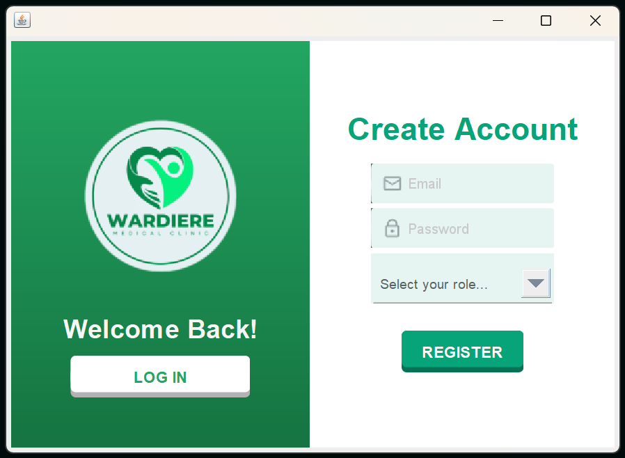

# Emergency Department Management
An emergency department management software developed as a group proyect for the Database University Course.

## Project User Manual
The system will have 4 main actors: 
- Manager
- Recepcionist
- Nurse
- Doctor

**Note**: *Refer to the project's documentation for an understanding of the patient flow. When testing the system, it is recommended to follow that order.*

## Table of Contents
1. [How to Download and Run the Project](#how-to-download-and-run-the-project)
2. [Initial Conditions of the Program](#initial-conditions-of-the-program)
3. [User Interface Views](#user-interface-views)
    - [Actor 1: Manager](#actor-1-manager)
    - [Actor 2: Recepcionist](#actor-2-recepcionist)
    - [Actor 3: Triage Nurse](#actor-3-triage-nurse)
    - [Actor 4: Doctor](#actor-4-doctor)

## How to Download and Run the Project

1. Clone the repository:
    ```bash
    git clone https://github.com/MamenCortes/Emergency-Department-Management.git
    ```
2. Execute the class **Application.java** in the package urgency.ui

## Initial Conditions of the Program

Upon executing the system for the first time, the following users will be automatically added to facilitate the system's navigation: 

| Email  | Password   | Role     |
|-----------|------------|----------|
| mamen.cortes@hospital.com     | 12345678   | Manager    |
| carmen.navarro@hospital.com   | 12345678 | Recepcionist  |
| maria.gala@hospital.com | 12345678| Nurse |
| sam.bennett@hospital.com     | 12345678   | Doctor    |
| meredith.grey@hospital.com     | 12345678   | Doctor    |
| owen.hunt@hospital.com     | 12345678   | Doctor    |
| carina.deluca@hospital.com     | 12345678   | Doctor    |
| alex.karev@hospital.com     | 12345678   | Doctor    |
| raj.sen@hospital.com     | 12345678   | Doctor    |

*The password 12345678 was used by default. However, it can be changed from the LogIn view*

## User Interface Views
### LogIn and Register
##### Log In


- Upon running the Application class, the first view will be the LogIn Panel. Here, the actors can log In into the system using their respective emails and passwords.
- By clicking the *Register* button, the LogIn panel changes into the Create Account panel.

##### Register


- Here recepcionists, nurses and managers can be registered.
- New doctors can only be created by the manager. 
- Only emails ending in *@hospital.com* will be able to register.
  
##### Change Password


- Passwords can be changed by clicking the *Forgot your password?* button. The user must introduce the email before. If the email introduced belongs to a user, the Change Password panel pops up.
- The passwords must contain at least one number and a minimum of 8 characters.
  
### Actor 1: Manager
##### Menu


##### Add Doctor


- The manager can add a new doctor either by hand or by an xml file.
- The doctor's user and password must be decided by the manager and given to the doctor. They will later be able to change their password.
- When importing the data from an xml file, first the information will be shown in the text fields. Then, the manager will have to check the data and decide the user's password. To create the doctor and their user, click *Apply*. 

##### Search Doctor
<div>
    
    
</div>

- The managers can search the doctors by their surname. First, write the surname in the textfield and click *Search*.
- If no surname is entered, the entire list of doctors will be shown.
- Click one of the doctors in the list and then, click *Open Form* to see the doctor's information.
- In the *Modify Doctor* panel, the manager is able to change their information or delete a doctor.
##### Add Speciality


- The manager can create new medical specialities by entering the name of the speciality.
- Specialities cannot be deleted from the database. 

##### Add Room


- In this view, the manager can add new boxes or triages.
- Boxes hava a speciality assigned. Triages don't. 

##### Search Room
<div>
    
    
</div>

- The managers can search the rooms by their id. First, select the type of room (Triage or Box), later write the id on the textfield, and click *Search*.
- If no id is entered, the entire list of Boxes or Triages will be shown.
- Click one of the rooms in the list and then, click *Open Form* to see the room's information.
- In the *Modify Room* panel, the manager is able to change the information or delete the room.
- Only the speciality of a box can be modified. 

##### General View


- This view intents to facilitate the daily/weekly/monthly schedule of the urgency by allowing the manager to assign doctors to boxes. 
- To do so, first select one of the boxes listed on the left. Then, a list of doctors with the same speciality as the box will be listed on the right.
- Select a maximum of 3 doctors per box. Use *ctrl* to select multiple and then click *Assign*.
- A doctor can only be assigned to one box at a time.
- A doctor can only be assigned to a box once on the same day. 

### Actor 2: Recepcionist

#### Menu


#### Add Patient


- Enter the patient's information and click *Apply*.
- All the fileds must be completed to create a patient.
- When created, their status is automatically set as *waiting* to later be assigned to a triage.
- If a patient with the same name and surname already exists in the database, an error message will be shown. 

#### Search and Admit Patient
<div>
    
    
</div>

- Recepcionists can search patients by their surname. To do so, write the surname on the textfield and click *Search*.
- If no surname is entered, the entire list of patients will be shown.
- Click one of the patients listed and then, click *Open Form* to see the patient's information.
- In the *Admit Patient* panel, the recepcionist should check that the patient's information is correct and change it if applicable.
- Select the patient's urgency and click *Admit* to readmit the patient into the urgency system. Their status is automatically set as *waiting*. 

### Actor 3: Triage Nurse

##### Select triage


- As nurses are not directly linked to the triage rooms, when they log in, they will have to select in which Triage they are working on.

#### Nurse View


- When the nurse selects a triage, their availability is set to *available*, and new patients from the waiting room will start to be assigned to the triage.
- Now, the nurse can see a preview of the patient assigned. Click the *Open Form* button to see the entire patient's information.
- To discharge the actual patient from the triage, click *Next Patient*.
- If the patient's form has been modified before clicking the *Next Patient* button, the patient will continue the *patient's flow* and will be assigned to a box. If not, the patient will be automatically set as *discharged* and their flow through the urgency will be interrupted. 

#### Patient Form
<div>
    
    
</div>

- The nurse will be in charge of completing the *physiological information* and performing a preliminary evaluation of the patient's status (by determining the urgency) and the main cause of their condition (by determining the specialty to which it will be referred).
- By clicking the *Apply* button, the changes will be saved.
- Then, *Nurse View* will be shown again.

### Actor 4: Doctor

#### Doctor View


- When a doctor logs in, the box's availability is set to *available* and new patients will be assigned. When the doctor logs out, the box's availability is set to *not available* and no more patients will be assigned to thas box until the doctor logs in again. 
- As well as the nurse, the doctor will be able to see a preview of the patient assigned to their box.
- The doctor will also be able to see a preview of the previous times the patient has been in the hospital's emergency department.
- Click the *Open Form* button to see the entire patient's information.
- Click the *Next patient* button to discharge the current patient and be assigned a new one.
- Click the *Into XML* button to generate an **XML** file containing the doctor's information. The file will be saved at the path *"/xmls/NameSurname.xml"* using the doctor's name and surname. Additionally, an **HTML** file will be generated at the path *"/xmls/Doctor.html"*.

#### Patient Form
<div>
    
    
    
</div>

- The doctor will be in charge of completing the *diagnosis details* after performing an evaluation of the patient. Some comments about the evaluation can be written.
- If necessary, the doctor can hospitalize a patient. If so, the patient will be managed by another hospital department.
- By clicking the *Apply* button, the changes will be saved.
- Then, the *Doctor view* will be shown again.

# Credits 
Developed by [María del Carmen Cortés](https://github.com/MamenCortes), [Paula Blanco](https://github.com/paulablancog), [Carmen Areses](https://github.com/CarmenEngBio) and [María Gala](https://github.com/MeryGala).

This project's user interface design was inspired by the [java-swing-login-ui-001](https://github.com/DJ-Raven/java-swing-login-ui-001) by [DJ Raven](https://github.com/DJ-Raven) on GitHub. We extend our gratitude to the contributors of that project for their work and inspiration.
